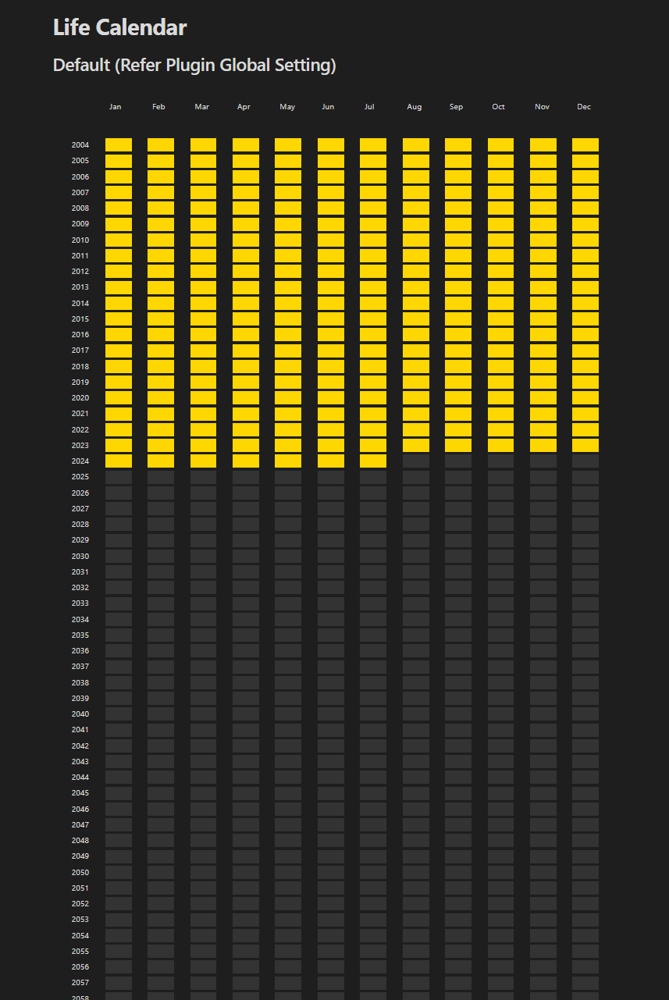

# Life Calendar Plugin Obsidian

Visualize your lifespan with a heatmap calendar. 



## How to install

- Clone this repo.
- Make sure your NodeJS is at least v16 (`node --version`).
- `npm i` or `yarn` to install dependencies.
- `npm run dev` to start compilation in watch mode. The .ts file will compile into .js file.

## Manually installing the plugin

- Copy over `main.js`, `styles.css`, `manifest.json` to your vault `VaultFolder/.obsidian/plugins/life-calendar-plugin/`.

## How to use
1) Create a DataviewJS block where you want the Life Heatmap Calendar to display. (Please install DataviewJS from the community plugin and enable Javascript Queries.)
2) Pass the data (optional) to the Life Heatmap Calendar using renderLifeCalendar().

### Examples
```dataviewjs
renderLifeCalendar(this.container);
```

```dataviewjs
const lifeData = {
    birth: 2010,
    average: 72,
    color: "#11ff11"
}
renderLifeCalendar(this.container, lifeData);
```


## Funding URL

```json
{
    "fundingUrl": "https://buymeacoffee.com"
}
```


## References
This plugin was inspired by the heatmap calendar project :D
https://github.com/Richardsl/heatmap-calendar-obsidian

